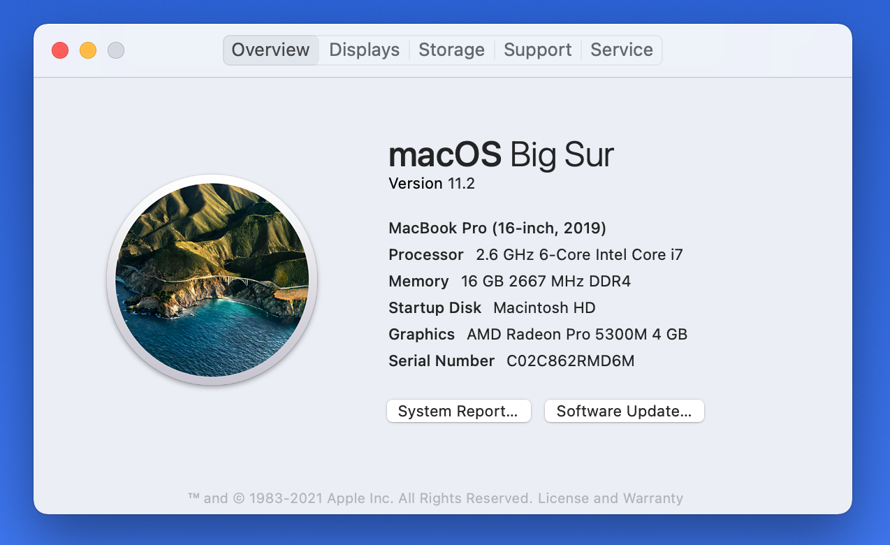

# Mac Users
Find out which macOS your Mac is using by referring to this article:
https://support.apple.com/en-us/HT201260

In the *About This Mac* window make sure your Mac has the latest updates by click the *Software Update...* button and following any installation instructions.

[Take a screenshot](https://support.apple.com/guide/mac-help/take-a-screenshot-or-screen-recording-mh26782/mac) of the *About This Mac* window and email it to [pj@digitalbrands.com](mailto:pj@digitalbrands.com) to confirm.

Should look similar to this:

# Windows Users
