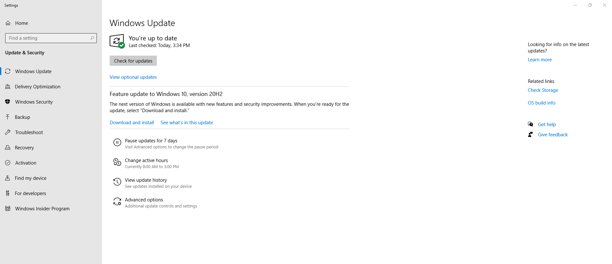
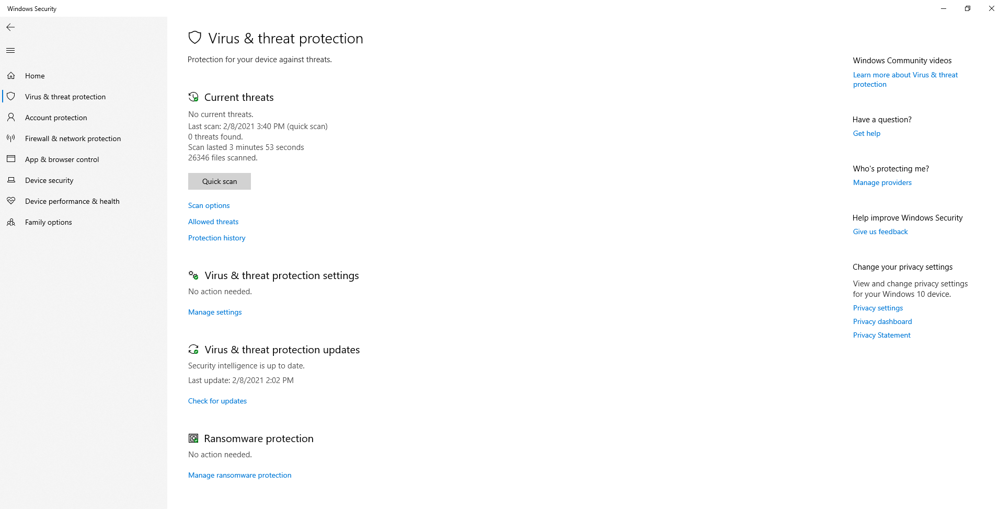
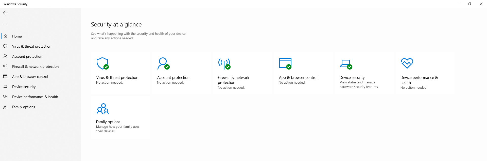

# Windows Users

## Updates
-> [Open the Windows Update Screen](https://support.microsoft.com/en-us/windows/update-windows-10-3c5ae7fc-9fb6-9af1-1984-b5e0412c556a). Download and install any available updates. 

Once updated, [take a screenshot](https://support.microsoft.com/en-us/windows/use-snipping-tool-to-capture-screenshots-00246869-1843-655f-f220-97299b865f6b) of the *Windows Update* window.

Should look similar to this:

## Virus Protection
-> [Open the Virus & Threat Protection Screen](https://docs.microsoft.com/en-us/windows/security/threat-protection/microsoft-defender-antivirus/microsoft-defender-security-center-antivirus#review-virus-and-threat-protection-settings-in-the-windows-security-app), perform any suggested updates or scans and then [take a screenshot](https://support.microsoft.com/en-us/windows/use-snipping-tool-to-capture-screenshots-00246869-1843-655f-f220-97299b865f6b).

Should look similar to this:

## Security
-> [Open the Security Screen](https://support.microsoft.com/en-us/windows/stay-protected-with-windows-security-2ae0363d-0ada-c064-8b56-6a39afb6a963) perform any suggested actions or updates and then [take a screenshot](https://support.microsoft.com/en-us/windows/use-snipping-tool-to-capture-screenshots-00246869-1843-655f-f220-97299b865f6b). 

Should look similar to this:

-> Email 3 screenshots to [pj@digitalbrands.com](mailto:pj@digitalbrands.com) to confirm.
